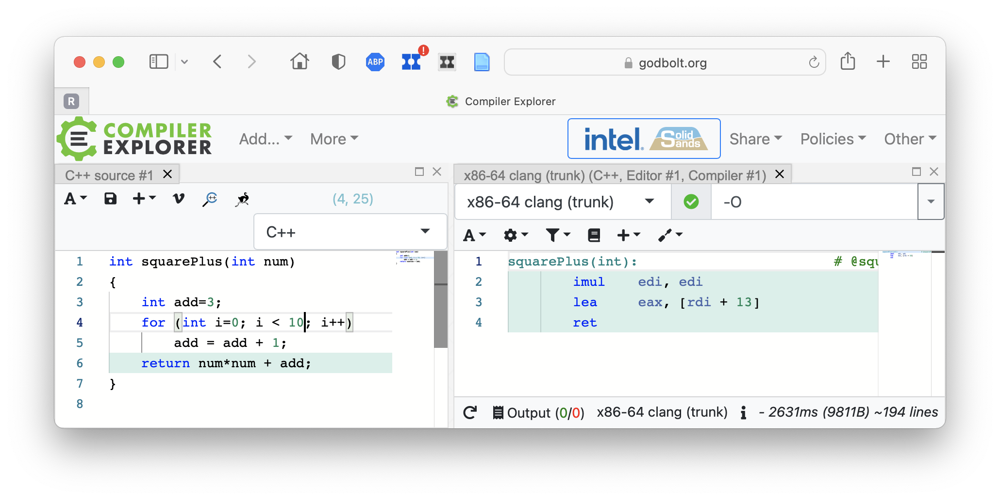
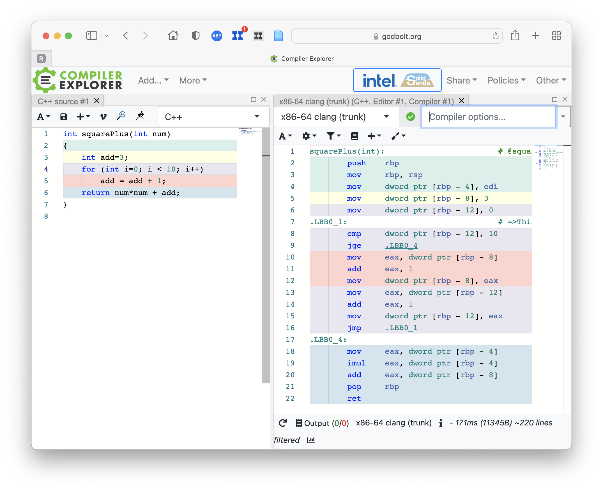

**Abstract.** Two screen snapshots (from https://godbolt.org) demonstrate C
optimization of constant loops.

```{r eval=FALSE}
int squarePlus(int num, int a)
{
    int add=3;
    for (int i=0; i < 10; i++)
        add = add + a;
    return num*num + add;
}
```






